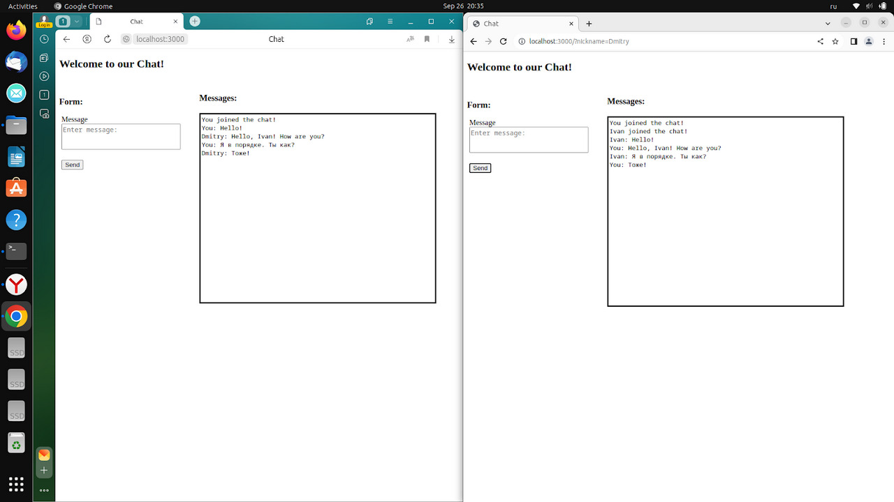

# О приложении
Данное приложение представляет из себя простой HTTP-чат-сервер, созданный с помощью платформы Node.js.

## Функционал
1. Приложение позволяет клиенту ввести свой ник, под которым он будет зарегестрирован в чате. В один и тот же момент времени в чате не могут быть 2 и более клиентов с одинаковыми никами;

2. Пользователь имеет возможность обмениваться текстовыми сообщениями с другими пользователями;

3. При подключении к чату клиента выводится сообщение, уведомляющее остальных участников о новом собеседнике. Аналогичные действия выполняются при отключении собеседника от чата - оповещение об этом отправляется всем клиентам чата через 1 минуту;

4. Сервер во время работы записывает в лог-файл информацию следующего вида: [< YYYY-MM-DD > hh:mm:ss] < ip пользователя > < тип запроса > < url >;

## Демо
